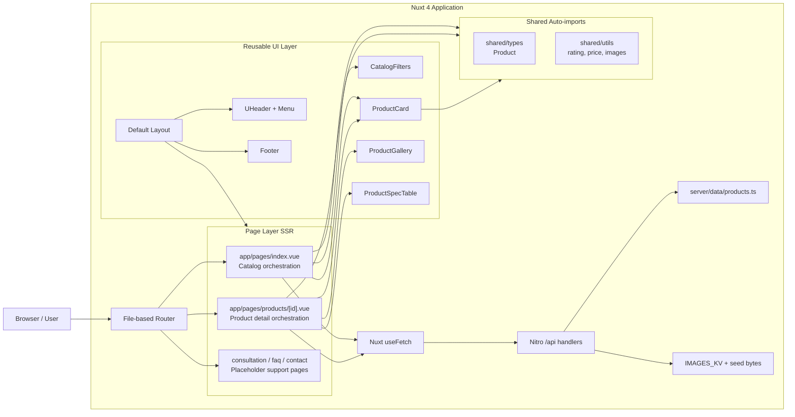
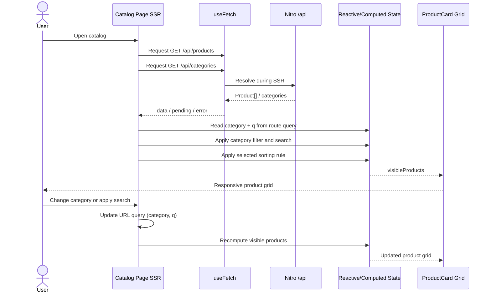
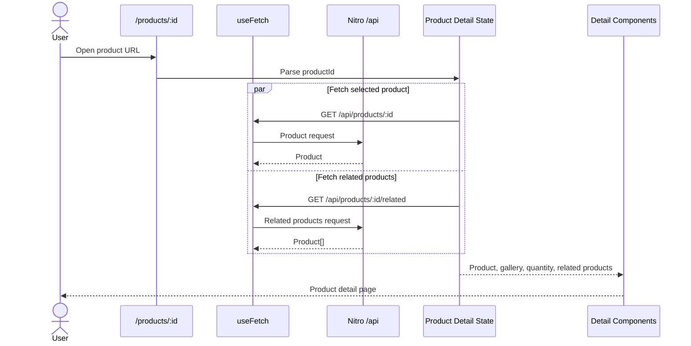
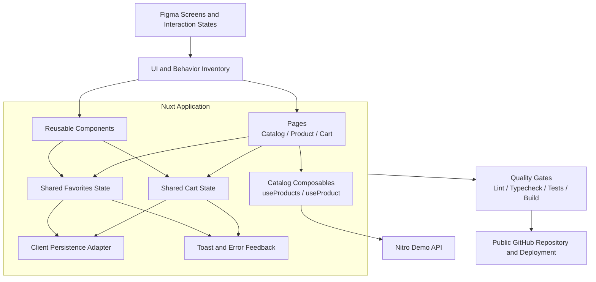

# Nuxt Commerce Demo

A frontend commerce implementation built for a technical hiring challenge using **Nuxt 4**, Vue 3, TypeScript, **Nuxt UI 4**, and an internal Nitro demo product API. The storefront brand is **فُروشگاه** (logotype mark **فُـ**).

The repository is intentionally documented as both:

- a record of the current implementation; and
- a clear completion plan for the remaining product and engineering work.

**Project status:** Core catalog browsing is live on Cloudflare Pages with full SSR, a Persian demo API, KV-backed product images, Figma-aligned tokens/layout, and placeholder support pages. Cart, favorites, automated tests, accessibility audit, and final pixel-perfect Figma filter review remain next steps.

**Production:** [https://demo-commerce.mohetios.dev/](https://demo-commerce.mohetios.dev/)  
**Repository:** [https://github.com/mohetios/nuxt-commerce-demo](https://github.com/mohetios/nuxt-commerce-demo)

## Full SSR Decision

This project is deliberately configured as a **full SSR** commerce UI.

### Why full SSR

- Catalog and product-detail pages must be readable on first paint with product content already present in the HTML response.
- SEO metadata for product pages depends on server-resolved product data.
- Reviewers should see a deterministic first render instead of a client-only loading waterfall.
- Same-origin `/api/*` calls during SSR avoid external-network flakiness from third-party demo APIs.

### How SSR is implemented

1. `ssr: true` is set explicitly in `nuxt.config.ts`, with page route rules forcing SSR for `/` and `/products/**`. API routes use `{ ssr: false }` so `/api/**` stay Nitro handlers (not prerendered page SSR).
2. Pages load data with Nuxt `useFetch` against internal routes such as `/api/products` and `/api/products/:id`.
3. During server render, `useFetch` resolves those Nitro handlers in-process, embeds the payload into the SSR response, and hydrates the client without refetching by default.
4. The demo catalog lives in `server/data/products.ts` and is exposed only through Nitro handlers. Pages never import the data pack directly.

### What `useFetch` gives us here

`useFetch` is SSR-aware by default in Nuxt. On the server it awaits the request before HTML is sent; on the client it reuses the SSR payload. That is exactly the data path this challenge needs for catalog and detail pages.

Client-only fetching (`$fetch` in `onMounted`, or disabling SSR for product routes) was rejected because it would move critical product content after hydration and weaken both SEO and first-content reliability.

### Boundary of the decision

Full SSR applies to storefront pages and their initial product payloads. Cart/favorites persistence can still become client shared state later without abandoning SSR for catalog and detail routes.

## Links

- Production: [https://demo-commerce.mohetios.dev/](https://demo-commerce.mohetios.dev/)
- Cloudflare Pages: [https://demo-commerc.pages.dev](https://demo-commerc.pages.dev)
- GitHub: [https://github.com/mohetios/nuxt-commerce-demo](https://github.com/mohetios/nuxt-commerce-demo)
- [Nuxt documentation](https://nuxt.com/docs)
- [Nuxt UI documentation](https://ui.nuxt.com)
- [Nitro server routes](https://nuxt.com/docs/guide/directory-structure/server)

## Challenge Objective

The purpose of the project is not only to reproduce a static design. It is intended to demonstrate how I approach a frontend product from design analysis to delivery:

- translate Figma screens into reusable UI boundaries;
- define a small, understandable application architecture;
- model product API data with TypeScript;
- implement responsive list and detail pages with full SSR;
- handle loading, failure, empty, and success states;
- keep navigation and filter state predictable;
- preserve room for cart and user interactions without prematurely over-engineering the codebase;
- document tradeoffs, remaining work, and quality gates honestly.

## Current Scope

### Implemented

- Nuxt 4 application structure with `app/` directory
- Vue 3 Composition API with `<script setup lang="ts">`
- Nuxt UI 4 and Tailwind CSS 4 based interface
- Brand **فُروشگاه** with **فُـ** logotype (`AppLogo`)
- Shared default layout, `UHeader` chrome, RTL navigation (`dir="rtl"`), and footer
- Persian RTL storefront (`lang="fa"` / `dir="rtl"`, Nuxt UI `fa_ir` locale)
- Vazirmatn applied across Nuxt UI theme font tokens (`sans` / `serif` / `mono`) via `@nuxt/fonts` (bundled with Nuxt UI)
- Internal Nitro demo API for products, categories, related items, and images
- Server-side Persian demo data pack (`server/data/products.ts`) — window/door fixtures (12 products)
- Typed product model and product helper functions (`shared/`, Nuxt auto-imports)
- Responsive product-card grid and sticky catalog filter sidebar (`CatalogFilters`)
- Product category filtering and local catalog search
- URL-backed filter state: `category` and search `q` query parameters
- Product sorting by featured order, price, and rating (page UI state)
- Dynamic product detail route: `/products/:id`
- Product gallery, specification table, and related-product selection
- Dynamic SEO metadata for product and support pages
- Loading skeletons, API error states, and empty filter results
- Figma-aligned design tokens, shell, catalog layout, and detail media/spec layout
- Nuxt Image (`NuxtImg`) with `provider: 'none'` for Cloudflare-safe product media
- Cloudflare KV image cache via `GET /api/images/*` (Unsplash → KV, offline seed fallback)
- Cloudflare Pages deploy (`cloudflare_pages` preset) with custom domain
- Placeholder pages for consultation, FAQ, and contact (`/consultation`, `/faq`, `/contact`)
- Explicit full-SSR configuration
- ESLint and strict TypeScript configuration
- CI workflow for lint and typecheck only (pins `packageManager` npm)
- Local development, typecheck, lint, build, preview, and deploy scripts

### Planned

- Complete pixel-perfect visual comparison against every Figma breakpoint and filter control state
- Shopping-cart state and cart drawer/page
- Quantity synchronization between product detail and cart
- Favorites/wishlist state
- Toast feedback for user actions
- Persistence for cart and favorites
- Empty states for cart and favorites (catalog empty/error states already exist)
- Component tests
- User-flow/E2E tests
- Accessibility audit (keyboard, focus, semantics, reduced motion)
- Deeper performance review beyond current Nuxt Image + KV image path
- Expand CI beyond lint/typecheck (tests and/or production build) if required for delivery

## Technology Stack

| Area | Technology | Responsibility |
| --- | --- | --- |
| Framework | Nuxt 4 | Routing, full SSR rendering, application conventions, SEO |
| UI runtime | Vue 3 | Reactive components and Composition API |
| Language | TypeScript | API contracts, props, helpers, and stricter correctness checks |
| Component system | Nuxt UI 4 | Accessible UI primitives and consistent component APIs |
| Styling | Tailwind CSS 4 | Responsive layout and design-token implementation |
| Typography | Vazirmatn via `@nuxt/fonts` | Persian/Arabic storefront type across UI tokens |
| Icons | Iconify (`lucide`, `simple-icons`) | UI actions and brand icon collections |
| Images | `@nuxt/image` (`provider: 'none'`) + Nitro `/api/images` | Same-origin product media with KV cache and fallbacks |
| Hosting | Cloudflare Pages + KV | Deploy target and durable demo image cache |
| Data pack | `server/data/products.ts` | Persian demo catalog used by Nitro handlers |
| Server API | Nitro `/api/*` | Products, categories, related products, and images |
| Data fetching | Nuxt `useFetch` | SSR-resolved initial API requests and request state |
| Quality | ESLint + Nuxt typecheck + GitHub Actions | Static analysis on every push/PR |
| Package manager | npm (`packageManager`: `npm@11.18.0`) | Lockfile + CI npm pin |

## Architecture Overview

The architecture stays small: pages own orchestration, components stay presentational, shared types/utils are auto-imported, and the demo catalog is served only through Nitro.



## Current Data Flow

### Catalog page



The URL is the source of truth for **category** (`?category=...`) and applied **search** (`?q=...`). Sorting remains page UI state because it does not yet need to be shareable or persisted.

### Product detail page



## Rendering and State Boundaries

```text
Remote server state (SSR via Nitro)
├── Product list
├── Category list
├── Product detail
├── Related products
├── Product images (/api/images)
└── Request status/error

URL state
├── Selected category (?category=)
└── Applied catalog search (?q=)

Local page state
├── Selected sort order
├── Draft search text (synced to URL on apply)
└── Selected quantity

Derived state
├── Filtered/sorted products
└── Product image list

Planned shared client state
├── Cart
└── Favorites
```

This separation prevents temporary UI state from being mixed with API data and avoids introducing a global store before shared state actually exists.

## Internal Demo API

| Method | Endpoint | Purpose |
| --- | --- | --- |
| `GET` | `/api/products` | Full demo catalog |
| `GET` | `/api/products?category=...` | Optional category filter (server-side) |
| `GET` | `/api/products/:id` | Single product |
| `GET` | `/api/products/:id/related` | Same-category related products |
| `GET` | `/api/categories` | Unique category labels |
| `GET` | `/api/images/{productId}/{slot}` | KV-backed product image bytes |
| `GET` | `/api/images/hero` | KV-backed hero image |

There is **no** external Fake Store (or other third-party commerce) API. The browser only talks to same-origin Nitro routes.

## Repository Structure

```text
.
├── app/
│   ├── app.config.ts             # Nuxt UI theme aliases
│   ├── app.vue                   # RTL html attrs + fa_ir locale
│   ├── assets/css/main.css       # Tailwind, Vazirmatn, Figma tokens
│   ├── components/
│   │   ├── AppLogo.vue
│   │   ├── AppBreadcrumb.vue
│   │   ├── CatalogFilters.vue
│   │   ├── MainHeader.vue        # UHeader shell
│   │   ├── MainMenu.vue          # RTL navigation
│   │   ├── MainFooter.vue
│   │   ├── ProductCard.vue
│   │   ├── ProductGallery.vue
│   │   └── ProductSpecTable.vue
│   ├── layouts/default.vue       # Shared application shell
│   └── pages/
│       ├── index.vue             # Catalog page
│       ├── products/[id].vue     # Dynamic product detail page
│       ├── consultation.vue      # Placeholder support page
│       ├── faq.vue
│       └── contact.vue
├── docs/figma-alignment/         # Figma alignment notes and fixtures
│   ├── CURSOR_FIGMA_ALIGNMENT.md
│   └── figma-demo-products.ts
├── public/
│   ├── favicon.ico
│   └── images/product-placeholder.svg
├── server/
│   ├── assets/demo-images/       # Offline image seeds for KV warm
│   ├── data/
│   │   ├── products.ts           # Persian demo data pack
│   │   └── product-image-sources.ts
│   ├── utils/image-cache.ts      # KV get/put, Unsplash fetch, seed fallback
│   └── api/
│       ├── categories/index.get.ts
│       ├── images/[...path].get.ts
│       └── products/
│           ├── index.get.ts
│           ├── [id].get.ts
│           └── [id]/related.get.ts
├── shared/
│   ├── types/product.ts          # Product contract (auto-imported)
│   └── utils/products.ts         # Product helpers (auto-imported)
├── .github/workflows/ci.yml      # Lint + typecheck (npm packageManager pin)
├── AGENTS.md                     # Agent/contributor scope and conventions
├── eslint.config.mjs
├── nuxt.config.ts                # SSR, fonts, image provider none, CF preset
├── wrangler.jsonc                # Pages + IMAGES_KV bindings
├── package.json
├── package-lock.json
├── tsconfig.json
└── README.md
```

## Key Engineering Decisions

### 1. Internal Nitro API + `useFetch` in pages

Pages call same-origin `/api/*` routes with `useFetch`. That keeps the data dependency visible at the page boundary while guaranteeing SSR resolution through Nitro.

A composable/API-client layer becomes useful when one or more of these conditions appear:

- request behavior is repeated across several pages;
- endpoint normalization becomes non-trivial;
- authentication or shared headers are introduced;
- caching and invalidation require explicit keys;
- multiple backend providers must share one frontend contract.

### 2. Typed API boundary

`shared/types/product.ts` owns the product contract and `shared/utils/products.ts` owns pure helper functions. Both are Nuxt auto-imports.

### 3. Server-only demo data pack

`server/data/products.ts` is never imported by Vue components. The browser only sees HTTP responses from `/api/*`, which mirrors a real BFF/backend boundary.

### 4. URL-backed filtering

Category selection (`?category=...`) and applied search (`?q=...`) are represented in the URL rather than hidden global state. They survive refreshes and create shareable catalog views. Sorting stays local until there is a clear need to share it.

### 5. Derived data stays computed

Filtered products, sorted products, and image lists are derived with `computed` state instead of being duplicated and manually synchronized. Catalog filtering currently runs in the page after `GET /api/products`; the collection endpoint also accepts an optional `category` query for server-side filtering when needed.

### 6. Reusable components remain presentation-focused

`ProductCard` receives a typed product and renders it. The catalog page owns filtering and sorting; the detail page owns route-aware fetching and product-specific orchestration. `CatalogFilters`, `ProductGallery`, and `ProductSpecTable` stay focused on UI.

### 7. Strictness without custom framework overrides

The project keeps Nuxt's generated TypeScript project references and adds stricter compiler checks through `nuxt.config.ts`, including:

- `strict`
- `exactOptionalPropertyTypes`
- `noUncheckedIndexedAccess`

### 8. Cloudflare-safe images

`@nuxt/image` uses `provider: 'none'` because IPX/Sharp is incompatible with Cloudflare Pages SSR. Product bytes are served from Nitro `/api/images/*` with KV caching and offline seed fallbacks from `server/assets/demo-images/`.

## Intended Target Architecture

The current implementation is enough for read-only catalog browsing. The next architecture adds shared interaction state while preserving the existing page/component boundaries.



The target does not require a backend rewrite. Cart and favorites can initially use Nuxt shared state or a small store with browser persistence. A server-backed cart would only be justified after authentication or cross-device synchronization is introduced.

## Delivery Plan

```mermaid
flowchart LR
    A[1. Inspect Figma]
    B[2. Inventory screens, states, breakpoints]
    C[3. Define tokens and component boundaries]
    D[4. Build shared layout and primitives]
    E[5. Connect typed Nitro demo API]
    F[6. Implement catalog]
    G[7. Implement product detail]
    H[8. Add cart and favorites]
    I[9. Cover loading, error, empty states]
    J[10. Responsive and accessibility pass]
    K[11. Tests and performance review]
    L[12. Build, deploy, document, deliver]

    A --> B --> C --> D --> E --> F --> G --> H --> I --> J --> K --> L

    classDef done fill:#dcfce7,stroke:#16a34a,color:#14532d;
    classDef active fill:#fef3c7,stroke:#d97706,color:#78350f;
    classDef planned fill:#e0e7ff,stroke:#4f46e5,color:#312e81;

    class A,B,C,D,E,F,G,I,L done;
    class H,J active;
    class K planned;
```



Notes on the plan colors:

- **Done:** foundation through product detail (Nitro/KV, not Fake Store), catalog loading/error/empty filter states, Cloudflare deploy + production domain, and delivery docs.
- **Active:** cart/favorites commerce interactions, plus remaining responsive/a11y polish and pixel-level Figma filter fidelity.
- **Planned:** automated tests and a deeper performance review beyond the current image pipeline.

## Milestones and Acceptance Criteria

### Milestone 1 — Foundation

**Status:** Complete

- Nuxt 4 project initialized
- Nuxt UI 4 and global styling configured
- Strict TypeScript and ESLint enabled
- Shared layout and navigation established
- Persian RTL chrome and Vazirmatn typography configured
- Brand فُروشگاه / فُـ logotype in place

### Milestone 2 — Catalog

**Status:** Complete

- Product collection loads from the internal Nitro demo API
- Loading and error states exist
- Category filter and local search work
- Selected category and applied search are represented in the URL
- Sort options work without mutating source data
- Product cards are responsive and reusable
- Sticky filter sidebar and Figma-aligned catalog shell are in place
- Window/door demo fixtures seed the catalog

### Milestone 3 — Product Detail

**Status:** Complete for read-only browsing

- Dynamic product route works
- Product data and SEO metadata are route-aware and SSR-resolved
- Quantity input is available
- Product gallery and specification table are separated into components
- Related products are fetched from `/api/products/:id/related`
- Missing/failing requests display a visible failure state

### Milestone 4 — Commerce Interaction

**Status:** Planned

- Add-to-cart updates shared cart state
- Re-adding a product updates quantity predictably
- Cart state persists across refreshes
- Cart total is derived rather than manually synchronized
- Remove, increment, decrement, and clear actions are covered
- Favorite state is shared and persistent
- User actions provide immediate accessible feedback

### Milestone 5 — Design and UX Completion

**Status:** Partially complete

**Done**

- Align global tokens, radii, palette, and page canvas with Figma
- Align header, footer, catalog layout, cards, and detail media/spec sections
- Ship placeholder consultation / FAQ / contact pages for primary nav
- Keep RTL-aware navigation and responsive breakpoints for mobile/desktop

**Remaining**

- Compare each screen against Figma at target breakpoints for pixel fidelity
- Validate remaining filter control spacing and interaction states against Figma
- Add empty/disabled states for cart and favorites once those flows exist
- Validate keyboard navigation and visible focus
- Check semantic headings, labels, link purpose, and image alternatives
- Review reduced-motion behavior where animation is present

### Milestone 6 — Verification and Delivery

**Status:** Partially complete

**Done**

- Lint passes locally and in CI
- Typecheck passes locally and in CI
- Production build and Cloudflare Pages deploy work
- Custom domain verified: [https://demo-commerce.mohetios.dev/](https://demo-commerce.mohetios.dev/)
- README tracks architecture, SSR, images, and delivery status
- Public repository history explains the development progression

**Remaining**

- Unit/component tests pass
- Critical user-flow tests pass
- Optional CI expansion for tests and/or production build
- Final responsive/a11y manual QA sign-off

## Testing Strategy

### Static checks

```bash
npm run lint
npm run typecheck
npm run check
npm run build
```

CI currently runs **only** `npm run lint` and `npm run typecheck` on every push and pull request. See [Setup → CI note](#ci-note) for the `packageManager` npm pin.

### Planned component coverage

**ProductCard**

- renders product fields safely;
- creates the correct detail URL;
- handles missing optional rating data.

**ProductGallery**

- renders supplied images;
- exposes meaningful alternative text;
- handles an empty image list.

**Catalog page**

- derives unique categories;
- filters by category;
- sorts without mutating the fetched collection;
- displays loading, error, empty, and populated states.

**Product detail page**

- parses the route id;
- renders API-backed metadata;
- excludes the active item from related products;
- uses fallback related products when the category has no alternatives.

### Planned E2E coverage

```text
Open catalog
→ filter category
→ open product
→ change quantity
→ add to cart
→ open cart
→ update quantity
→ remove product
→ verify totals and persistence
```

## Commit Strategy

The repository history should communicate the implementation progression. A suitable sequence is:

```text
chore: initialize Nuxt application and quality tooling
feat: add shared commerce layout and theme
feat: add typed product boundary and Nitro demo API
feat: implement responsive product catalog
feat: add category query state and product sorting
feat: implement dynamic product detail route
feat: add loading error and related-product states
feat: deploy to Cloudflare Pages with KV image cache
feat: align Figma tokens layout and window/door fixtures
feat: add shared cart and favorite state
accessibility: review keyboard and semantic behavior
test: add catalog and cart coverage
docs: document architecture decisions and delivery status
```

Commits should stay focused: one understandable product or engineering change per commit, without mixing unrelated formatting and feature work.

## Setup

### Prerequisites

- Node.js 22+ (CI uses Node 22; compatible with the current Nuxt release)
- npm matching `package.json` `packageManager` (`npm@11.18.0`) — or install that version in CI as the workflow does

### Install

```bash
npm install
```

### Development

```bash
npm run dev
```

The app is available at [http://localhost:3000](http://localhost:3000) by default. Local `nuxt dev` uses the `IMAGES_KV` binding via `nitro-cloudflare-dev`.

### Quality checks

```bash
npm run check
```

Or run the checks independently:

```bash
npm run lint
npm run lint:fix
npm run typecheck
```

### Production build

Default Nuxt build (uses `nitro.preset: 'cloudflare_pages'` from `nuxt.config.ts`):

```bash
npm run build
```

Explicit Cloudflare Pages preset:

```bash
npm run build:cf
```

### Preview

```bash
npm run preview
```

Cloudflare Pages local preview of `dist/`:

```bash
npm run preview:cf
```

### Cloudflare Pages

Project name: `demo-commerc`  
Production URL: https://demo-commerce.mohetios.dev/  
Cloudflare Pages URL: https://demo-commerc.pages.dev

```bash
npm run deploy
```

This runs `build:cf` and uploads `dist/` through Wrangler (`wrangler pages deploy`).

Demo product images are served from `GET /api/images/{productId}/{slot}` (and `/api/images/hero`). On first request the Nitro handler tries Unsplash, stores bytes in the `IMAGES_KV` binding (`demo-commerc-images` in `wrangler.jsonc`), and returns same-origin responses on later hits. If Unsplash is unreachable (common on restricted networks), it falls back to `server/assets/demo-images/` seeds and still warms KV. If both upstream and seed fail (or KV is unavailable), the handler still returns HTTP 200 with an SVG placeholder so NuxtImg never receives a hard error. Catalog/detail cards also swap to `/images/product-placeholder.svg` on `@error`.

`wrangler.jsonc` binds `IMAGES_KV` to:

- production id: `8f718a0081784f56bd9fe2f3d03255a6` (`demo-commerc-images`)
- preview id: `8ba3ed241d624d288d47b851c61a2413` (`demo-commerc-images_preview`)

`npm run deploy` applies that binding from config. If the Pages project was created before the KV block existed, confirm **Settings → Functions → KV namespace bindings** shows `IMAGES_KV` pointing at `demo-commerc-images`.

### CI note

`.github/workflows/ci.yml` runs lint + typecheck only (no test or production-build job).

The lockfile was generated with **npm 11** (`packageManager`: `npm@11.18.0`). GitHub Actions’ default Node 22 ships npm 10, which can reject some lockfile optional-peer entries. CI therefore installs the `packageManager` npm version before `npm ci`.

## Known Limitations

The repository is not yet a complete checkout product.

- Add-to-cart and save buttons are currently visual interactions only.
- Cart and favorite state have not been implemented.
- Product data is a server-side demo pack, not a production commerce backend.
- Product images are Unsplash demos cached in Cloudflare KV and served through Nitro (`/api/images/*`), not a production media CDN.
- Automated component/E2E tests are not yet included.
- CI covers lint and typecheck only (no test or build job yet).
- Final pixel-level Figma comparison for filters and every breakpoint is still required.
- No authentication, payment, inventory reservation, order submission, or durable persistence is included.

These limitations are intentionally documented so reviewers can distinguish current behavior from the proposed architecture.

## Review Guide

For a focused code review, start with:

- `app/pages/index.vue` — catalog SSR data flow, URL state (`category`, `q`), filtering, search, and sorting;
- `app/pages/products/[id].vue` — route-aware SSR fetching and detail orchestration;
- `app/components/CatalogFilters.vue` — sticky filter sidebar UI;
- `app/components/ProductCard.vue` — typed reusable component boundary + NuxtImg fallback;
- `app/components/ProductGallery.vue` — isolated gallery behavior with NuxtImg;
- `app/components/ProductSpecTable.vue` — detail specification presentation;
- `app/components/MainHeader.vue` / `MainMenu.vue` — UHeader shell and RTL nav;
- `app/components/AppLogo.vue` — فُـ / فُروشگاه brand mark;
- `server/data/products.ts` — Persian demo data pack;
- `server/api/products/*` — Nitro product endpoints;
- `server/api/images/[...path].get.ts` — KV-backed image proxy;
- `server/utils/image-cache.ts` — Unsplash → KV → seed → placeholder pipeline;
- `shared/types/product.ts` — product contract (auto-imported);
- `shared/utils/products.ts` — pure helpers (auto-imported);
- `nuxt.config.ts` — full SSR, fonts, Nuxt Image `provider: 'none'`, Cloudflare preset;
- `wrangler.jsonc` — Pages project and `IMAGES_KV` bindings;
- `.github/workflows/ci.yml` — lint + typecheck CI + npm pin;
- `package.json` — quality and delivery commands;
- `AGENTS.md` — scope and contributor conventions for agents.
