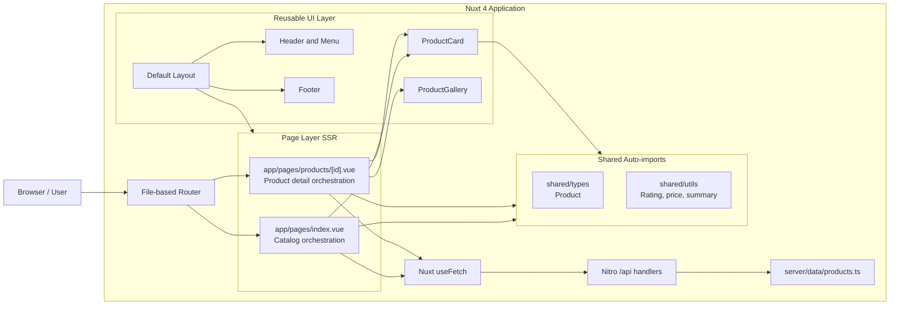
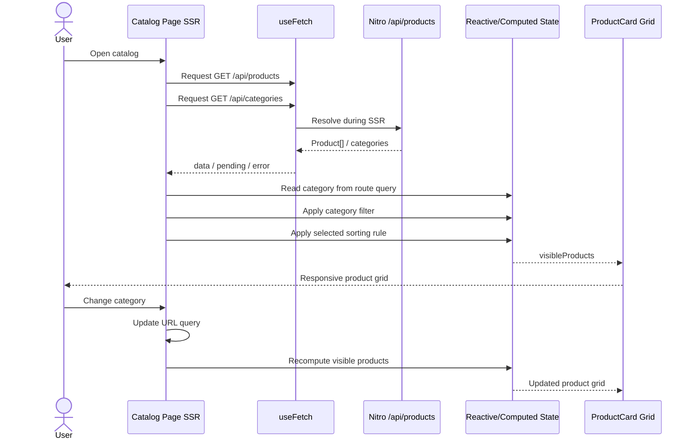
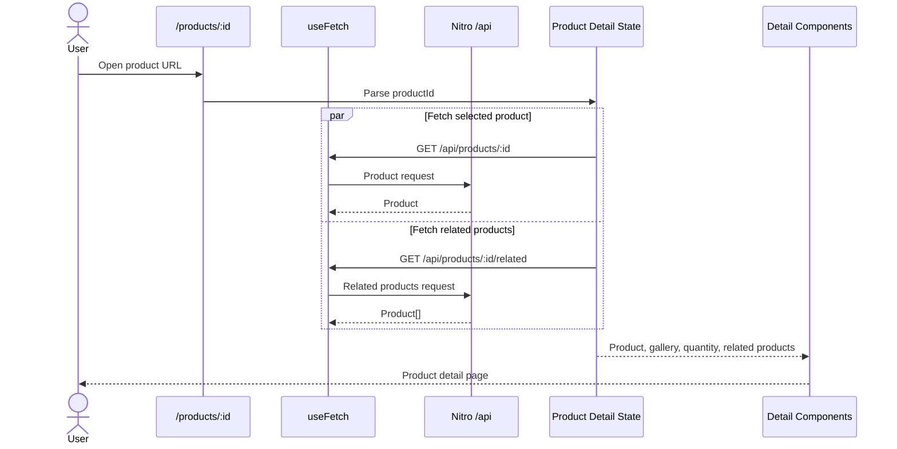
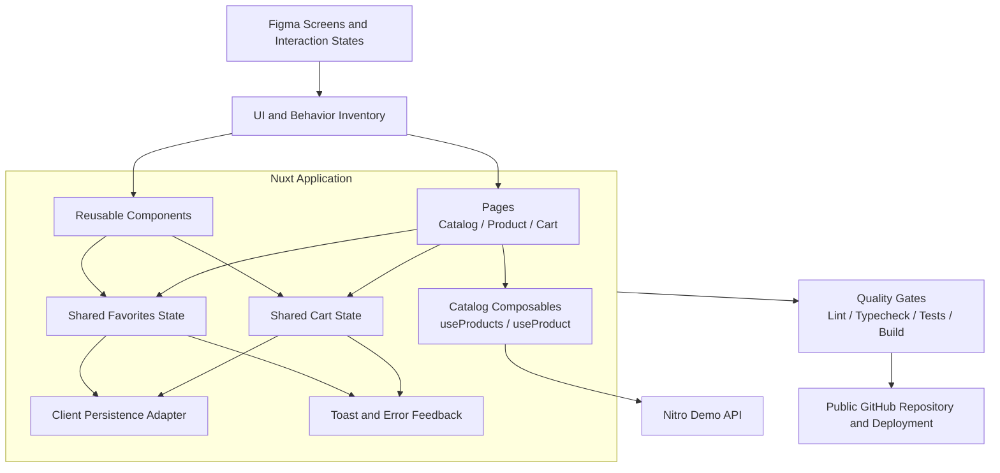

# Nuxt Commerce Demo

A frontend commerce implementation built for a technical hiring challenge using Nuxt 4, Vue 3, TypeScript, Nuxt UI, and an internal Nitro demo product API.

The repository is intentionally documented as both:

- a record of the current implementation; and
- a clear completion plan for the remaining product and engineering work.

**Project status:** Core catalog browsing is implemented with a Persian demo data pack served by Nuxt server routes and rendered through full SSR. Cart, favorites, automated tests, and final Figma-fidelity review remain next steps.

## Full SSR Decision

This project is deliberately configured as a **full SSR** commerce UI.

### Why full SSR

- Catalog and product-detail pages must be readable on first paint with product content already present in the HTML response.
- SEO metadata for product pages depends on server-resolved product data.
- Reviewers should see a deterministic first render instead of a client-only loading waterfall.
- Same-origin `/api/*` calls during SSR avoid external-network flakiness from third-party demo APIs.

### How SSR is implemented

1. `ssr: true` is set explicitly in `nuxt.config.ts`, with page route rules forcing SSR for `/` and `/products/**`.
2. Pages load data with Nuxt `useFetch` against internal routes such as `/api/products` and `/api/products/:id`.
3. During server render, `useFetch` resolves those Nitro handlers in-process, embeds the payload into the SSR response, and hydrates the client without refetching by default.
4. The demo catalog lives in `server/data/products.ts` and is exposed only through Nitro handlers. Pages never import the data pack directly.

### What `useFetch` gives us here

`useFetch` is SSR-aware by default in Nuxt. On the server it awaits the request before HTML is sent; on the client it reuses the SSR payload. That is exactly the data path this challenge needs for catalog and detail pages.

Client-only fetching (`$fetch` in `onMounted`, or disabling SSR for product routes) was rejected because it would move critical product content after hydration and weaken both SEO and first-content reliability.

### Boundary of the decision

Full SSR applies to storefront pages and their initial product payloads. Cart/favorites persistence can still become client shared state later without abandoning SSR for catalog and detail routes.

## Links

- [Nuxt documentation](https://nuxt.com/docs)
- [Nuxt UI documentation](https://ui.nuxt.com)
- [Nitro server routes](https://nuxt.com/docs/guide/directory-structure/server)

## Challenge Objective

The purpose of the project is not only to reproduce a static design. It is intended to demonstrate how I approach a frontend product from design analysis to delivery:

- translate Figma screens into reusable UI boundaries;
- define a small, understandable application architecture;
- model product API data with TypeScript;
- implement responsive list and detail pages with full SSR;
- handle loading, failure, empty, and success states;
- keep navigation and filter state predictable;
- preserve room for cart and user interactions without prematurely over-engineering the codebase;
- document tradeoffs, remaining work, and quality gates honestly.

## Current Scope

### Implemented

- Nuxt 4 application structure
- Vue 3 Composition API with `<script setup lang="ts">`
- Nuxt UI and Tailwind CSS based interface
- Shared default layout, header, navigation, and footer
- Persian RTL storefront chrome (`lang="fa"` / `dir="rtl"`)
- Internal Nitro demo API for products, categories, and related items
- Server-side Persian demo data pack (`server/data/products.ts`)
- Typed product model and product helper functions
- Responsive product-card grid
- Product category filtering
- URL-backed category state using the `category` query parameter
- Product sorting by featured order, price, and rating
- Dynamic product detail route: `/products/:id`
- Product gallery component
- Related-product selection via `/api/products/:id/related`
- Dynamic SEO metadata for product pages
- Loading skeletons
- API error states
- Explicit full-SSR configuration
- ESLint and strict TypeScript configuration
- Local development, typecheck, lint, build, and preview scripts

### Planned

- Complete visual comparison against every Figma breakpoint and state
- Shopping-cart state and cart drawer/page
- Quantity synchronization between product detail and cart
- Favorites/wishlist state
- Search and improved catalog discovery
- Empty states for filters, cart, favorites, and failed product lookup
- Toast feedback for user actions
- Persistence for cart and favorites
- Component tests
- User-flow/E2E tests
- Accessibility audit
- Performance and image-loading review
- CI workflow for lint, typecheck, tests, and production build
- Deployment and final delivery verification

## Technology Stack

| Area | Technology | Responsibility |
| --- | --- | --- |
| Framework | Nuxt 4 | Routing, full SSR rendering, application conventions, SEO |
| UI runtime | Vue 3 | Reactive components and Composition API |
| Language | TypeScript | API contracts, props, helpers, and stricter correctness checks |
| Component system | Nuxt UI | Accessible UI primitives and consistent component APIs |
| Styling | Tailwind CSS | Responsive layout and design implementation |
| Icons | Iconify | Lucide and brand icon collections |
| Data pack | `server/data/products.ts` | Persian demo catalog used by Nitro handlers |
| Server API | Nitro `/api/*` | Products, categories, and related-product endpoints |
| Data fetching | Nuxt `useFetch` | SSR-resolved initial API requests and request state |
| Quality | ESLint + Nuxt typecheck | Static analysis and framework-aware type checking |

## Architecture Overview

The architecture stays small: pages own orchestration, components stay presentational, shared types/utils are auto-imported, and the demo catalog is served only through Nitro.



## Current Data Flow

### Catalog page



The URL is the source of truth for category selection. Sorting remains local UI state because it does not yet need to be shareable or persisted.

### Product detail page



## Rendering and State Boundaries

```text
Remote server state (SSR via Nitro)
├── Product list
├── Category list
├── Product detail
├── Related products
└── Request status/error

URL state
└── Selected category

Local page state
├── Selected sort order
└── Selected quantity

Derived state
├── Filtered/sorted products
└── Product image list

Planned shared client state
├── Cart
└── Favorites
```

This separation prevents temporary UI state from being mixed with API data and avoids introducing a global store before shared state actually exists.

## Internal Demo API

| Method | Endpoint | Purpose |
| --- | --- | --- |
| `GET` | `/api/products` | Full demo catalog |
| `GET` | `/api/products?category=...` | Optional category filter |
| `GET` | `/api/products/:id` | Single product |
| `GET` | `/api/products/:id/related` | Same-category related products |
| `GET` | `/api/categories` | Unique category labels |

## Repository Structure

```text
.
├── app/
│   ├── app.config.ts             # Nuxt UI theme aliases
│   ├── assets/css/main.css       # Tailwind and theme styles
│   ├── components/
│   │   ├── MainHeader.vue
│   │   ├── MainMenu.vue
│   │   ├── MainFooter.vue
│   │   ├── ProductCard.vue
│   │   └── ProductGallery.vue
│   ├── layouts/default.vue       # Shared application shell
│   └── pages/
│       ├── index.vue             # Catalog page
│       └── products/[id].vue     # Dynamic product detail page
├── server/
│   ├── data/products.ts          # Persian demo data pack
│   └── api/
│       ├── categories/index.get.ts
│       └── products/
│           ├── index.get.ts
│           ├── [id].get.ts
│           └── [id]/related.get.ts
├── shared/
│   ├── types/product.ts          # Product contract (auto-imported)
│   └── utils/products.ts         # Product helpers (auto-imported)
├── eslint.config.mjs
├── nuxt.config.ts
├── package.json
├── tsconfig.json
└── README.md
```

## Key Engineering Decisions

### 1. Internal Nitro API + `useFetch` in pages

Pages call same-origin `/api/*` routes with `useFetch`. That keeps the data dependency visible at the page boundary while guaranteeing SSR resolution through Nitro.

A composable/API-client layer becomes useful when one or more of these conditions appear:

- request behavior is repeated across several pages;
- endpoint normalization becomes non-trivial;
- authentication or shared headers are introduced;
- caching and invalidation require explicit keys;
- multiple backend providers must share one frontend contract.

### 2. Typed API boundary

`shared/types/product.ts` owns the product contract and `shared/utils/products.ts` owns pure helper functions. Both are Nuxt auto-imports.

### 3. Server-only demo data pack

`server/data/products.ts` is never imported by Vue components. The browser only sees HTTP responses from `/api/*`, which mirrors a real BFF/backend boundary.

### 4. URL-backed filtering

Category selection is represented by `?category=...` rather than hidden global state. It survives refreshes and creates directly shareable catalog views.

### 5. Derived data stays computed

Filtered products, sorted products, and image lists are derived with `computed` state instead of being duplicated and manually synchronized.

### 6. Reusable components remain presentation-focused

`ProductCard` receives a typed product and renders it. The catalog page owns filtering and sorting; the detail page owns route-aware fetching and product-specific orchestration.

### 7. Strictness without custom framework overrides

The project keeps Nuxt's generated TypeScript project references and adds stricter compiler checks through `nuxt.config.ts`, including:

- `strict`
- `exactOptionalPropertyTypes`
- `noUncheckedIndexedAccess`

## Intended Target Architecture

The current implementation is enough for read-only catalog browsing. The next architecture adds shared interaction state while preserving the existing page/component boundaries.



The target does not require a backend rewrite. Cart and favorites can initially use Nuxt shared state or a small store with browser persistence. A server-backed cart would only be justified after authentication or cross-device synchronization is introduced.

## Delivery Plan

```mermaid
flowchart LR
    A[1. Inspect Figma]
    B[2. Inventory screens, states, breakpoints]
    C[3. Define tokens and component boundaries]
    D[4. Build shared layout and primitives]
    E[5. Connect typed product API]
    F[6. Implement catalog]
    G[7. Implement product detail]
    H[8. Add cart and favorites]
    I[9. Cover loading, error, empty states]
    J[10. Responsive and accessibility pass]
    K[11. Tests and performance review]
    L[12. Build, deploy, document, deliver]

    A --> B --> C --> D --> E --> F --> G --> H --> I --> J --> K --> L

    classDef done fill:#dcfce7,stroke:#16a34a,color:#14532d;
    classDef active fill:#fef3c7,stroke:#d97706,color:#78350f;
    classDef planned fill:#e0e7ff,stroke:#4f46e5,color:#312e81;

    class A,B,C,D,E,F,G done;
    class I active;
    class H,J,K,L planned;
```




## Milestones and Acceptance Criteria

### Milestone 1 — Foundation

**Status:** Complete

- Nuxt 4 project initialized
- Nuxt UI and global styling configured
- Strict TypeScript and ESLint enabled
- Shared layout and navigation established

### Milestone 2 — Catalog

**Status:** Complete

- Product collection loads from the internal Nitro demo API
- Loading and error states exist
- Category filter works
- Selected category is represented in the URL
- Sort options work without mutating source data
- Product cards are responsive and reusable

### Milestone 3 — Product Detail

**Status:** Complete for read-only browsing

- Dynamic product route works
- Product data and SEO metadata are route-aware and SSR-resolved
- Quantity input is available
- Product gallery is separated into a component
- Related products are fetched from `/api/products/:id/related`
- Missing/failing requests display a visible failure state

### Milestone 4 — Commerce Interaction

**Status:** Planned

- Add-to-cart updates shared cart state
- Re-adding a product updates quantity predictably
- Cart state persists across refreshes
- Cart total is derived rather than manually synchronized
- Remove, increment, decrement, and clear actions are covered
- Favorite state is shared and persistent
- User actions provide immediate accessible feedback

### Milestone 5 — Design and UX Completion

**Status:** Planned

- Compare each screen against Figma at target breakpoints
- Validate spacing, type scale, images, controls, and interaction states
- Add empty states and disabled states
- Validate keyboard navigation and visible focus
- Check semantic headings, labels, link purpose, and image alternatives
- Review reduced-motion behavior where animation is present

### Milestone 6 — Verification and Delivery

**Status:** Planned

- Unit/component tests pass
- Critical user-flow tests pass
- Lint passes
- Typecheck passes
- Production build passes
- Responsive manual QA passes
- README matches the actual implementation
- Public repository history explains the development progression
- Deployment URL and repository URL are verified before delivery

## Testing Strategy

### Static checks

```bash
npm run lint
npm run typecheck
npm run check
npm run build
```

### Planned component coverage

**ProductCard**

- renders product fields safely;
- creates the correct detail URL;
- handles missing optional rating data.

**ProductGallery**

- renders supplied images;
- exposes meaningful alternative text;
- handles an empty image list.

**Catalog page**

- derives unique categories;
- filters by category;
- sorts without mutating the fetched collection;
- displays loading, error, empty, and populated states.

**Product detail page**

- parses the route id;
- renders API-backed metadata;
- excludes the active item from related products;
- uses fallback related products when the category has no alternatives.

### Planned E2E coverage

```text
Open catalog
→ filter category
→ open product
→ change quantity
→ add to cart
→ open cart
→ update quantity
→ remove product
→ verify totals and persistence
```

## Commit Strategy

The repository history should communicate the implementation progression. A suitable sequence is:

```text
chore: initialize Nuxt application and quality tooling
feat: add shared commerce layout and theme
feat: add typed product boundary and Nitro demo API
feat: implement responsive product catalog
feat: add category query state and product sorting
feat: implement dynamic product detail route
feat: add loading error and related-product states
feat: add shared cart and favorite state
accessibility: review keyboard and semantic behavior
test: add catalog and cart coverage
docs: document architecture decisions and delivery status
```

Commits should stay focused: one understandable product or engineering change per commit, without mixing unrelated formatting and feature work.

## Setup

### Prerequisites

- Node.js compatible with the current Nuxt release
- npm 11 or a compatible npm version

### Install

```bash
npm install
```

### Development

```bash
npm run dev
```

The app is available at [http://localhost:3000](http://localhost:3000) by default.

### Quality checks

```bash
npm run check
```

Or run the checks independently:

```bash
npm run lint
npm run typecheck
```

### Production build

```bash
npm run build
```

### Preview

```bash
npm run preview
```

### Cloudflare Pages

Project name: `demo-commerc`  
Production URL: https://demo-commerc.pages.dev

```bash
npm run deploy
```

This builds with the `cloudflare_pages` Nitro preset and uploads `dist/` through Wrangler.

Demo product images are served from `GET /api/images/{productId}/{slot}` (and `/api/images/hero`). On first request the Nitro handler tries Unsplash, stores bytes in the `IMAGES_KV` binding (`demo-commerc-images` in `wrangler.jsonc`), and returns same-origin responses on later hits. If Unsplash is unreachable (common on restricted networks), it falls back to `server/assets/demo-images/` seeds and still warms KV. If both upstream and seed fail (or KV is unavailable), the handler still returns HTTP 200 with an SVG placeholder so NuxtImg never receives a hard error. Catalog/detail cards also swap to `/images/product-placeholder.svg` on `@error`. Local `nuxt dev` uses the same binding via `nitro-cloudflare-dev`.

`wrangler.jsonc` binds `IMAGES_KV` to:

- production id: `8f718a0081784f56bd9fe2f3d03255a6` (`demo-commerc-images`)
- preview id: `8ba3ed241d624d288d47b851c61a2413` (`demo-commerc-images_preview`)

`npm run deploy` applies that binding from config. If the Pages project was created before the KV block existed, confirm **Settings → Functions → KV namespace bindings** shows `IMAGES_KV` pointing at `demo-commerc-images`.

## Known Limitations

The repository is not yet a complete checkout product.

- Add-to-cart and save buttons are currently visual interactions only.
- Cart and favorite state have not been implemented.
- Product data is a server-side demo pack, not a production commerce backend.
- Product images are Unsplash demos cached in Cloudflare KV and served through Nitro (`/api/images/*`), not a production media CDN.
- Automated tests and CI are planned but not yet included.
- Final pixel-level Figma comparison is still required.
- No authentication, payment, inventory reservation, order submission, or durable persistence is included.

These limitations are intentionally documented so reviewers can distinguish current behavior from the proposed architecture.


## Review Guide

For a focused code review, start with:

- `app/pages/index.vue` — catalog SSR data flow, URL state, filtering, and sorting;
- `app/pages/products/[id].vue` — route-aware SSR fetching and detail orchestration;
- `app/components/ProductCard.vue` — typed reusable component boundary;
- `app/components/ProductGallery.vue` — isolated visual behavior;
- `server/data/products.ts` — Persian demo data pack;
- `server/api/products/*` — Nitro product endpoints;
- `shared/types/product.ts` — product contract (auto-imported);
- `shared/utils/products.ts` — pure helpers (auto-imported);
- `nuxt.config.ts` — full SSR and TypeScript strictness;
- `package.json` — quality and delivery commands.

